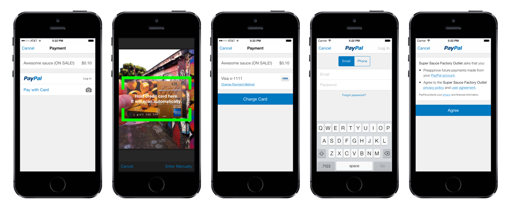

PayPal iOS SDK
==============

The PayPal iOS SDK makes it easy to add PayPal and credit card payments to mobile apps.



*This documentation is available in Japanese: [日本語のドキュメント](docs/ja/README.md).*

>### Note
> There are 4 static libraries that you should link when building your application. `libPayPalMobile.a`, `libCardIO.a`, `libopencv_core.a', and `libopencv_imgproc.a` are required for all of the SDK functionality.
>
> The current version of the PayPal iOS SDK was built using Xcode 7.0+.
>
> If you are still using Xcode 6.4, you may experience link errors (duplicate symbols). If you can't upgrade from Xcode 6.4, please use version **2.11.x** of this SDK.
>
> If you are still using Xcode 6.2, you may experience link errors (duplicate symbols). If you can't upgrade from Xcode 6.2, please use version **2.10.2** of this SDK.

## Contents

- [Use Cases](#use-cases)
- [Requirements](#requirements)
- [Add the SDK to Your Project](#add-the-sdk-to-your-project)
- [Credentials](#credentials)
- [International Support](#international-support)
- [Testing](#testing)
- [Documentation](#documentation)
- [Usability](#usability)
- [Moving to PayPal iOS SDK 2.0](#moving-to-paypal-ios-sdk-20)
- [Next Steps](#next-steps)


## Use Cases

The SDK supports two use cases for making payments - **Single Payment** and **Future Payments** - and a third use case for obtaining information about the customer - **Profile Sharing**.


### Single Payment

Receive a one-time payment from a customer's PayPal account or payment card (scanned with [card.io](https://www.card.io/)). This can be either (1) an **immediate** payment which your servers should subsequently **verify**, or (2) an **authorization** for a payment which your servers must subsequently **capture**, or (3) a payment for an **order** which your servers must subsequently **authorize** and **capture**:

1. [Accept a Single Payment](docs/single_payment.md) and receive back a proof of payment.
2. On your server, [Verify the Payment](https://developer.paypal.com/webapps/developer/docs/integration/mobile/verify-mobile-payment/), [Capture the Payment](https://developer.paypal.com/webapps/developer/docs/integration/direct/capture-payment/#capture-the-payment), or [Process the Order](https://developer.paypal.com/webapps/developer/docs/integration/direct/create-process-order/) (PayPal Developer site) using PayPal's API.

*Note:* Direct Credit Card Payments is only available in a [select few countries](https://developer.paypal.com/webapps/developer/docs/integration/direct/rest_api_payment_country_currency_support/#direct-credit-card-payments).  Also, see the [International Support](#international-support) section for details on the specific currencies supported.


### Future Payments

Your customer logs in to PayPal just one time and consents to future payments:

1. [Obtain Customer Consent](docs/future_payments_mobile.md#obtain-customer-consent) to receive an authorization code.
2. On your server, use this authorization code to [Obtain OAuth2 Tokens](docs/future_payments_server.md#obtain-oauth2-tokens).

Later, when that customer initiates a payment:

1. [Obtain a Client Metadata ID](docs/future_payments_mobile.md#obtain-an-application-correlation-id) that you'll pass to your server.
2. On your server, [Create a Payment](docs/future_payments_server.md#create-a-payment) using your OAuth2 tokens, the Client Metadata ID, and PayPal's API.


### Profile Sharing

Your customer logs in to PayPal and consents to PayPal sharing information with you:

1. [Obtain Customer Consent](docs/profile_sharing_mobile.md#obtain-customer-consent) to receive an authorization code.
2. On your server, use this authorization code to [Obtain OAuth2 Tokens](docs/profile_sharing_server.md#obtain-oauth2-tokens).
3. On your server, [Retrieve Customer Information](docs/profile_sharing_server.md#retrieve-customer-information) using your OAuth2 tokens and PayPal's API.


## Requirements

* Xcode 7 and iOS SDK 9
* iOS 6.0+ target deployment
* armv7, armv7s, and arm64 devices, and the simulator (not armv6)
* iPhone and iPad of all sizes and resolutions


## Add the SDK to Your Project

### If you use [CocoaPods](http://cocoapods.org), then add these lines to your podfile:

```ruby
platform :ios, '6.0'
pod 'PayPal-iOS-SDK'
```

### If you don't use CocoaPods, then:

1. Clone or download the SDK, which consists of header files, license acknowledgements, release notes, and a static library. It also includes a sample app.
    * **As of version 2.12.0, the SDK requires Xcode 7 and iOS 8 SDK.**
2. Add the `PayPalMobile` directory (containing several .h files and libPayPalMobile.a) to your Xcode project. We recommend checking "Copy items..." and selecting "Create groups...".
3. (Optionally) Add the `CardIO` directory (containing several .h files, `libCardIO.a`, `libopencv_core.a`, and `libopencv_imgproc.a`) to your Xcode project. We recommend checking "Copy items..." and selecting "Create groups...". `libCardIO.a`, `libopencv_core.a`, and `libopencv_imgproc.a` adds the functionality to pay by scanning a card.
4. In your project's **Build Settings** (in the `TARGETS` section, not the `PROJECTS` section):
  * add `-lc++ -ObjC` to `Other Linker Flags`
  * enable `Enable Modules (C and Objective-C)`
  * enable `Link Frameworks Automatically`
5. In your project's **Build Phases**, link your project with these libraries. Weak linking for iOS versions back to 6.0 is supported.
  * `Accelerate.framework`
  * `AudioToolbox.framework`
  * `AVFoundation.framework`
  * `CoreLocation.framework`
  * `CoreMedia.framework`
  * `MessageUI.framework`
  * `MobileCoreServices.framework`
  * `SystemConfiguration.framework`
  * `SafariServices.framework`

### With or without CocoaPods:

1. Add the open source license acknowledgments from acknowledgments.md to [your app's acknowledgments](http://stackoverflow.com/questions/3966116/where-to-put-open-source-credit-information-for-an-iphone-app).
2. In your app's Info.plist, add the following URL schemes to `LSApplicationQueriesSchemes`:
  * `com.paypal.ppclient.touch.v1`
  * `com.paypal.ppclient.touch.v2`
  * `org-appextension-feature-password-management`

## Credentials

Your mobile integration requires different `client_id` values for each environment: Live and Test (Sandbox).

Your server integrations for verifying or creating payments will also require the corresponding `client_secret` for each `client_id`.

You can obtain these PayPal API credentials by visiting the [Applications page on the PayPal Developer site](https://developer.paypal.com/webapps/developer/applications) and logging in with your PayPal account.

### Sandbox

Once logged in on this Applications page, you will be assigned **test credentials**, including Client ID, which will let you test your iOS integration against the PayPal Sandbox.

While testing your app, when logging in to PayPal in the SDK's UI you should use a *personal* Sandbox account email and password. I.e., not your Sandbox *business* credentials.

You can create both business and personal Sandbox accounts on the [Sandbox accounts](https://developer.paypal.com/webapps/developer/applications/accounts) page.

### Live

To obtain your **live** credentials, you will need to have a business account. If you don't yet have a business account, there is a link at the bottom of that same Applications page that will get you started.


## International Support

### Localizations

The SDK has built-in translations for many languages and locales. See the header files for a complete list.

### Currencies

The SDK supports multiple currencies. See [the REST API country and currency documentation](https://developer.paypal.com/webapps/developer/docs/integration/direct/rest_api_payment_country_currency_support/) for a complete, up-to-date list.

Note that currency support differs for payment card versus PayPal payments. Unless you disable payment card acceptance (via the `PayPalConfiguration.acceptCreditCards` property), **we recommend limiting transactions to currencies supported by both payment types.** Currently these are: USD, GBP, CAD, EUR, JPY.

If your app initiates a transaction with a currency that turns out to be unsupported for the user's selected payment type, then the SDK will display an error to the user and write a message to the console log.


## Testing

During development and testing, set the environment to Sandbox or NoNetwork/Mock mode, to avoid moving real money around. See the header files for more information.


## Documentation

* These docs in the SDK, which include an overview of usage, step-by-step integration instructions, and sample code.
* The sample app included in this SDK.
* Header files are thoroughly documented; refer to them as needed for extra details about any given property or parameter.
* The [PayPal Developer Docs](https://developer.paypal.com/docs), which cover error codes and server-side integration instructions.


## Usability

User interface appearance and behavior is set within the library itself. For the sake of usability and user experience consistency, apps should not adjust appearance properties or attempt to modify the SDK's behavior beyond the documented methods in the provided headers.

Specifically, if you are using `UIAppearance` to modify the appearance of any UI elements in your app, you should reverse those changes prior to presenting our viewcontroller, and set them again after dismissing the viewcontroller.


## Moving to PayPal iOS SDK 2.0


### Upgrade from 1.x

As a major version change, the API introduced in 2.0 is not backward compatible with 1.x integrations. However, the SDK still supports all previous single payment functionality. Upgrading is straightforward.

* Initialization of the SDK is performed via methods of a new `PayPalMobile` class.
* Most of the properties of `PayPalPaymentViewController` have been moved to `PayPalConfiguration`, and the `PayPalPaymentViewController` initializer has changed to take such a configuration object.
* The `PayPalPaymentDelegate` protocol methods have also been altered to include a `PayPalPaymentViewController` as a parameter.


### Older Libraries

PayPal is in the process of replacing the older "Mobile Payments Libraries" (MPL) with the new PayPal Android and iOS SDKs.
The new Mobile SDKs are based on the PayPal REST API, while the older MPL uses the Adaptive Payments API.

Until features such as third-party, parallel, and chained payments are available, if needed, you can use MPL:

 - [MPL on GitHub](https://github.com/paypal/sdk-packages/tree/gh-pages/MPL)
 - [MPL Documentation](https://developer.paypal.com/webapps/developer/docs/classic/mobile/gs_MPL/)

Issues related to MPL should be filed in the [sdk-packages repo](https://github.com/paypal/sdk-packages/).

Developers with existing Express Checkout integrations or who want additional features may wish to use [Mobile Express Checkout](https://developer.paypal.com/webapps/developer/docs/classic/mobile/gs_MEC/)
in a webview.


## Next Steps

Depending on your use case, you can now:

* [Accept a single payment](docs/single_payment.md)
* [Obtain user consent](docs/future_payments_mobile.md) to [create future payments](docs/future_payments_server.md).
* [Obtain user consent](docs/profile_sharing_mobile.md) to [retrieve customer information](docs/profile_sharing_server.md).

